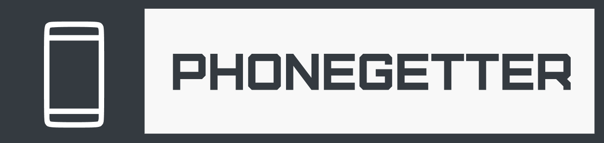

## 🧑‍💻 About Us
We are a small team of two schoolchildren who, as part of a school project, developed a system for monitoring phones in a school in real time. Our goal was to create a system that is both convenient and secure. The project consists of two main components:

1. **The Device**: A custom-built hardware solution for securely storing phones.
2. **The Website**: A web interface that integrates with the device to provide real-time data and manage interactions in a user-friendly way.

Together, these components form a single ecosystem that simplifies the process of monitoring and managing phones within a school environment.

---

## 🎯 Core Features

### 📦 Device Features
- **🔒 Secure Phone Storage**: The device is designed to securely store phones in dedicated slots.
- **🌐 Wi-Fi Integration**: Connects to the internet to exchange data with the website.
- **🔄 Real-Time Data Updates**: Communicates cell states and statuses to the website through an PhoneGetter API.

### 🌍 Website Features
- **📊 Teacher Dashboard**: Provides detailed insights into the status of stored phones.
- **👨‍🎓 Student Access**: Allows students to track their phone statuses.
- **🔗 Seamless Device Integration**: The device and website function as a unified system.

---

## ⚙️ Technologies Used
- **Backend**: Python (Flask), RESTful API
- **Frontend**: Jinja2, HTML/CSS, Bootstrap, JS
- **Device Firmware**: Arduino IDE, ESP8266 libraries
- **Database**: PostgreSQL
- **Networking**: MQTT protocol & HTTP API

---


## 📜 Documentation

| **Component**        | **Link**                                                                                                        |
|----------------------|-----------------------------------------------------------------------------------------------------------------|
| **Mqtt Broker**      | [PhoneGetter MQTT Broker](https://github.com/PavelFr8/PhoneGetter_mqtt)                                         |
| **PhoneGetter API**  | [PhoneGetter API Documentation](https://github.com/PavelFr8/PhoneGetter/blob/main/app/api/api_documentation.md) |
| **Device**           | [Device Documentation]([#](https://github.com/PavelFr8/PhoneGetter_device))                                                                                       |
| **Website**          | [Website Guide](https://github.com/PavelFr8/PhoneGetter/blob/main/app/website_guide.md)                     |


## 🚀 Installation Guide
#### 1️⃣ **Clone The Repository**
 ```bash
 git clone https://github.com/PavelFr8/PhoneGetter.git
 cd PhoneGetter
 ```
#### 2️⃣ **Set Up Virtual Environment**

 ```bash
 python3 -m venv venv
 source venv/bin/activate   # On Windows, use `venv\Scripts\activate`
 ```

#### 3️⃣ **Install dependencies**

 ```bash
 pip install -r requirements.txt
 ```

#### 4️⃣ **Configure Environment Variables**
 - Create a .env file in the root directory.
 - Reference [.env_example](https://github.com/PavelFr8/PhoneGetter/blob/main/.env_example) for configuration details.
#### 5️⃣  **Initialize The Database**

 ```bash
 flask db init
 flask db migrate
 flask db upgrade
 ```

#### 6️⃣  **Run the application**

 ```bash
 flask run
 ```
